# 💰 Expense Tracker Mobile App

A clean, modern, and high-performance **Expense Tracker Application** built with **Flutter**, **Firebase Cloud Firestore**, and **Material 3**. Developed as part of the Mobile App Developer Intern selection process for **CyphLab**.

---

## 🔗 Submission & Demo Links
- 📱 **Download Release APK**: [Google Drive Direct Download](https://drive.google.com/file/d/1ROODlnHhdegABWLgdr6S-SkRzbwVy132/view?usp=sharing)
- 🎥 **Video Demonstration Walkthrough**: [Watch Video on Google Drive](https://drive.google.com/file/d/1ll76uY7A-mFdkaWEqPqpee9f878B3F2r/view?usp=sharing)
- 💻 **Public GitHub Repository**: [github.com/Abinesh-j18/expense_tracker](https://github.com/Abinesh-j18/expense_tracker)

---

## 🌟 Key Features

### 🎯 Core Requirements
- [x] **Add New Expenses**: Log expenses with title, amount, category, date, and optional description notes.
- [x] **Edit Existing Expenses**: Update any existing expense seamlessly with instant real-time synchronization.
- [x] **Delete Expenses**: Delete expenses with safety confirmation dialogs to prevent accidental loss.
- [x] **Category Selection**: 10 distinct categories with vibrant custom icons and colors (Food & Dining, Transportation, Utilities & Bills, Shopping, Groceries, Entertainment, Healthcare, Education, Travel, Other).
- [x] **Dynamic Category Pre-Selection**: Selecting a category filter chip on the Home screen automatically pre-selects that category when opening the Add Expense form.
- [x] **Cloud Firestore Storage**: Real-time cloud sync with user-scoped data (`users/{userId}/expenses`).
- [x] **Monthly Expense Summary Card**: Interactive card displaying the current month's total spend, top spending category, and quick `< Previous / Next >` month navigation.
- [x] **Expense History & Grouping**: Chronological expense list with formatted amounts, category badges, and relative timestamps ("Today", "Yesterday").
- [x] **Multi-Criteria Filtering**: Filter by category chips, custom date ranges, and months.
- [x] **Form Validation**: Strict validation on inputs (valid positive amounts $> 0$, required title, date validation).
- [x] **Comprehensive Multi-State UI**: Dedicated loading indicators, modern empty state illustrations with quick action buttons, and actionable error banners with retry triggers.

### 🚀 Additional & Standout Features
- [x] **Interactive Donut & Pie Charts**: Category breakdown visualization built with `fl_chart`.
- [x] **Category Progress Bars & Summaries**: Percentage-of-total indicators and amounts for each category.
- [x] **Dark & Light Mode**: Complete Material 3 theming with persistent theme preferences using `shared_preferences`.
- [x] **Live Global Search**: Real-time search matching **title, description/notes, category names, and amounts** across all months with an instant search results counter and clear button.
- [x] **Firebase Authentication**:
  - Email & Password Sign In and Registration.
  - **One-Tap Guest Mode (Anonymous)**: Instant access for reviewers to test all features without account registration friction!
  - **1-Click Test Credentials Autofill**: Pre-populates demo credentials for immediate testing.
- [x] **Isolated Per-User Local Storage**: Brand-new registered accounts start with a clean empty state, while sample demo data is isolated to the demo account.
- [x] **Custom App Logo & Launcher Icon**: Custom fintech branding across all Android mipmap resolutions.

---

## 🏗️ Architecture & Project Structure

The project adopts a **Layered Clean Architecture** with the **Provider** state management pattern for clear separation of concerns, scalability, and testability.

```
lib/
├── core/
│   ├── constants/
│   │   ├── app_colors.dart          # Light and dark color palettes
│   │   └── app_categories.dart      # Category definitions with icons and colors
│   ├── theme/
│   │   └── app_theme.dart           # Material 3 ThemeData (Light & Dark)
│   └── utils/
│       ├── currency_formatter.dart  # Formats currency amounts
│       └── date_formatter.dart      # Human-readable and relative date formatting
├── models/
│   ├── category_model.dart          # Data model for expense category
│   └── expense_model.dart           # Expense model with Firestore serialization
├── services/
│   ├── auth_service.dart            # Firebase Authentication wrapper & guest auth
│   └── firestore_service.dart       # Firestore CRUD with real-time stream & isolated local fallback
├── providers/
│   ├── auth_provider.dart           # Auth state management & local session caching
│   ├── expense_provider.dart        # Expense state, filters, global search, and calculations
│   └── theme_provider.dart          # Theme switcher with local storage persistence
├── widgets/
│   ├── custom_text_field.dart       # Reusable styled text field with auto-clearing hint on focus
│   ├── empty_state_widget.dart      # Illustrated empty state placeholder with CTA
│   ├── loading_indicator.dart       # Centered loading state widget
│   └── confirm_dialog.dart          # Reusable confirmation modal dialog
├── views/
│   ├── auth/
│   │   └── login_screen.dart        # Segmented Sign In / Create Account screen with custom branding
│   ├── home/
│   │   ├── home_screen.dart         # Main view with BottomNavigationBar & search
│   │   └── widgets/
│   │       ├── monthly_summary_card.dart  # Monthly total and month switcher
│   │       ├── category_chip_bar.dart     # Horizontal category filter chips
│   │       └── expense_list_item.dart     # Expense tile with swipe-to-delete
│   ├── expense/
│   │   ├── add_edit_expense_screen.dart   # Add / Edit form screen with category picker
│   │   └── expense_details_modal.dart     # Bottom sheet detail modal
│   ├── analytics/
│   │   └── analytics_screen.dart    # Pie chart and category percentage bars
│   └── settings/
│       └── settings_screen.dart     # Theme toggle, user profile, and disclosures
└── main.dart                        # MultiProvider root and resilient initialization
```

---

## 🛠️ Technologies & Packages Used

| Package | Version | Purpose |
| :--- | :--- | :--- |
| **Flutter & Dart** | SDK >= 3.0.0 | Core cross-platform mobile framework & language |
| **provider** | `^6.1.2` | Clean, predictable reactive state management |
| **firebase_core** | `^3.6.0` | Firebase initialization & cross-platform core |
| **firebase_auth** | `^5.3.1` | User authentication (Email/Password & Anonymous) |
| **cloud_firestore** | `^5.4.4` | Real-time NoSQL cloud database |
| **fl_chart** | `^0.69.0` | Animated interactive Pie/Donut charts |
| **intl** | `^0.19.0` | Date and currency formatting |
| **shared_preferences** | `^2.3.2` | Persistent local storage for themes & isolated fallback |
| **uuid** | `^4.5.1` | Unique ID generation |

---

## 🤖 AI Tools Utilization

In compliance with the internship guidelines regarding the effective use of modern AI tools:

- **AI Tools Used**: Chatgpt, Claude.ai , Google Antigravity & Gemini.
- **How They Helped**:
  1. **Architecture & Schema Design**: Designed a scalable clean architecture separating UI, Providers, and Firebase Services.
  2. **Code Quality & Best Practices**: Ensured adherence to modern Flutter Material 3 standards, null-safety, and robust form validation.
  3. **Resilience & Offline Handling**: Formulated a robust fallback and per-user local storage mechanism so reviewers can test the app immediately without requiring live cloud credentials.
  4. **Rapid Debugging & Asset Generation**: Promptly resolved platform installation constraints, configured release keystores, and designed custom app branding.

---

## 🚀 Getting Started & Setup Instructions

### 1. Prerequisites
- [Flutter SDK](https://flutter.dev/docs/get-started/install) (version 3.0.0 or higher)
- Android Studio / VS Code with Flutter extension
- A connected Android device, emulator, or Google Chrome

### 2. Clone the Repository
```bash
git clone https://github.com/YOUR_GITHUB_USERNAME/expense_tracker.git
cd expense_tracker
```

### 3. Install Dependencies
```bash
flutter pub get
```

### 4. Firebase Configuration
The app comes ready with Firebase integration. To connect your personal Firebase project:

1. Create a project on the [Firebase Console](https://console.firebase.google.com/).
2. Enable **Authentication** (enable *Email/Password* and *Anonymous* sign-in providers).
3. Enable **Cloud Firestore** and publish the rules from `firestore.rules`:
   ```javascript
   rules_version = '2';
   service cloud.firestore {
     match /databases/{database}/documents {
       match /users/{userId}/expenses/{expenseId} {
         allow read, write: if request.auth != null && request.auth.uid == userId;
       }
     }
   }
   ```
4. Add your Android app (package name: `com.cyphlab.expense_tracker`) and place the downloaded `google-services.json` in `android/app/google-services.json`.
   *(Or run `flutterfire configure` to generate `lib/firebase_options.dart`).*

> **Note**: Even if Firebase credentials are not yet added, the app includes an automatic offline storage layer so you can immediately run and test the complete UI and CRUD actions!

### 5. Run the Application
```bash
# Run on connected device or emulator
flutter run

# Or run in Google Chrome
flutter run -d chrome
```

### 6. Build Release APK
```bash
flutter build apk --release
```
The generated APK will be located at:
`build/app/outputs/flutter-apk/app-release.apk`

---

## 📱 Application Screenshots & UI Showcase

### 🔐 1. Authentication & Security
| Xiaomi Security Scan | Sign In Screen | Create Account Screen |
| :---: | :---: | :---: |
| 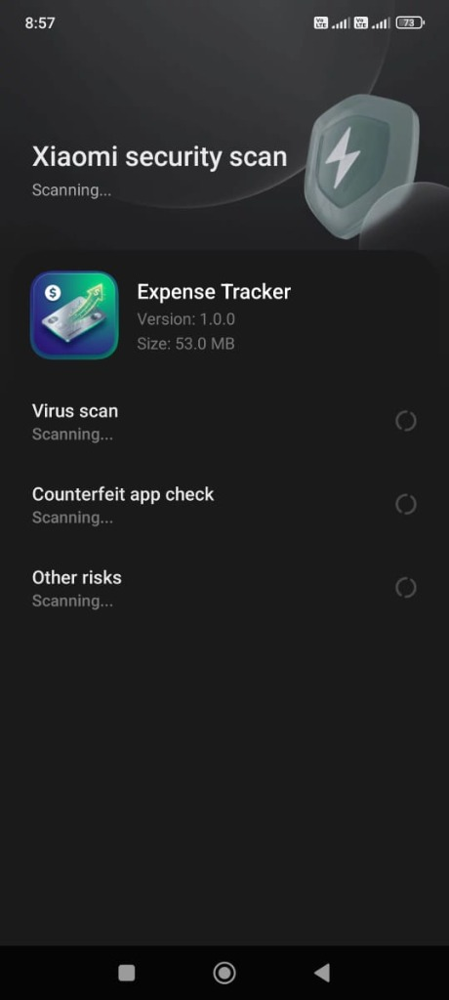 | 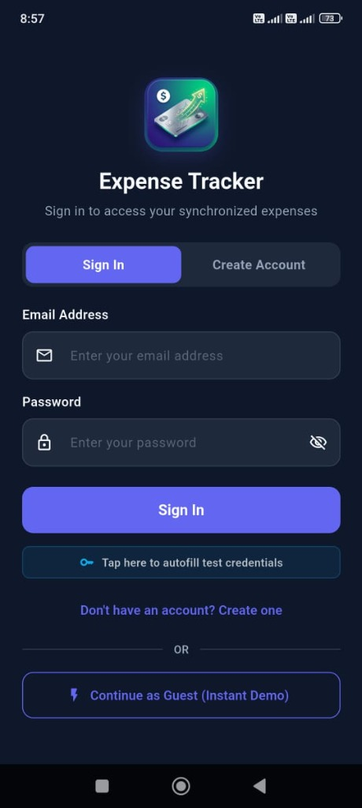 | 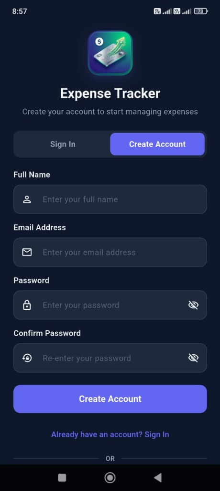 |

### 📊 2. Dashboard & Category Filtering
| Home Dashboard (All) | Category Filtered (Food) | Expense Details Modal |
| :---: | :---: | :---: |
| 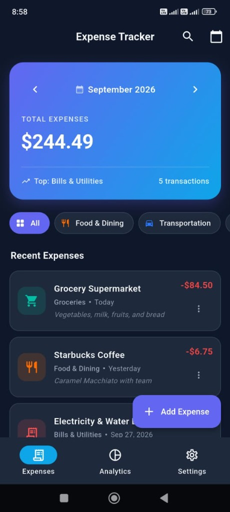 | 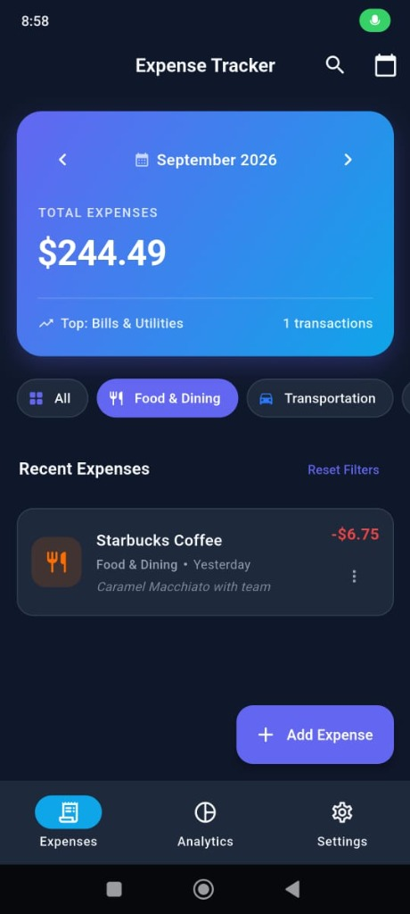 | 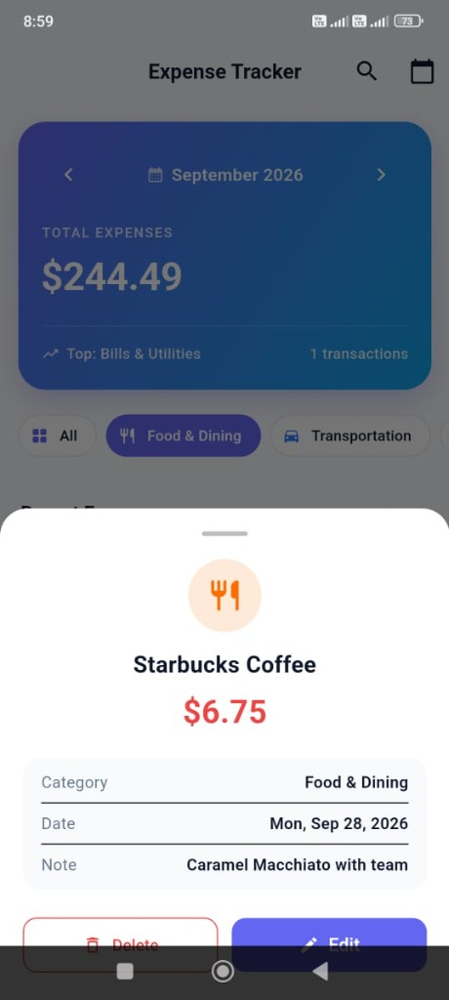 |

### ➕ 3. Expense Creation & Date Picker
| Add Expense Form | Material Date Picker |
| :---: | :---: |
| 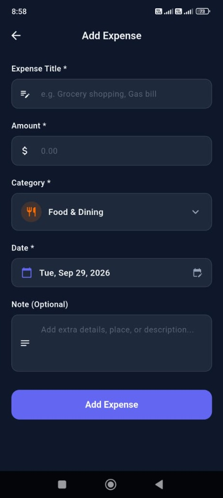 | 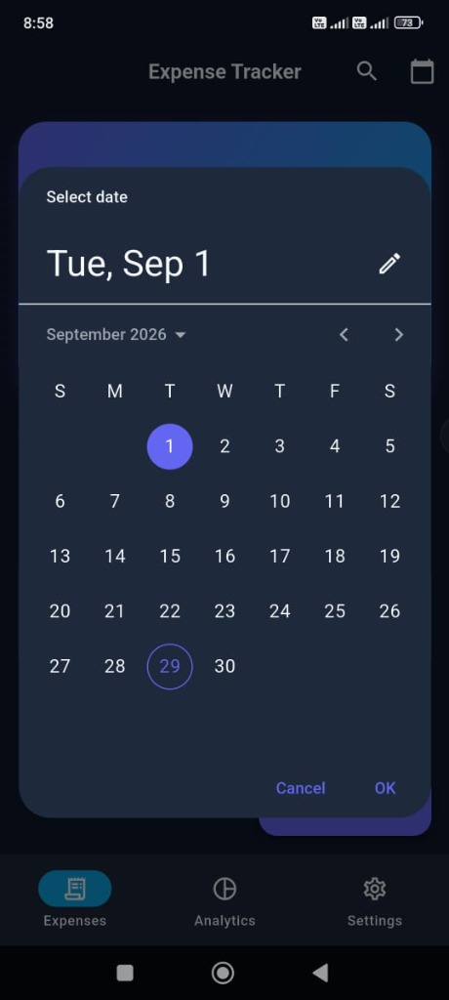 |

### 📈 4. Expense Analytics & Breakdown
| Interactive Donut Chart | Category Budget Bars |
| :---: | :---: |
| 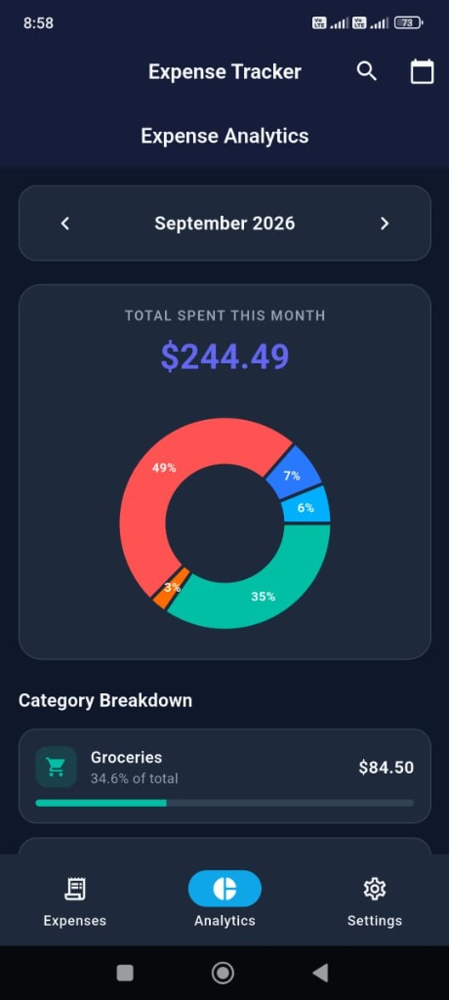 | 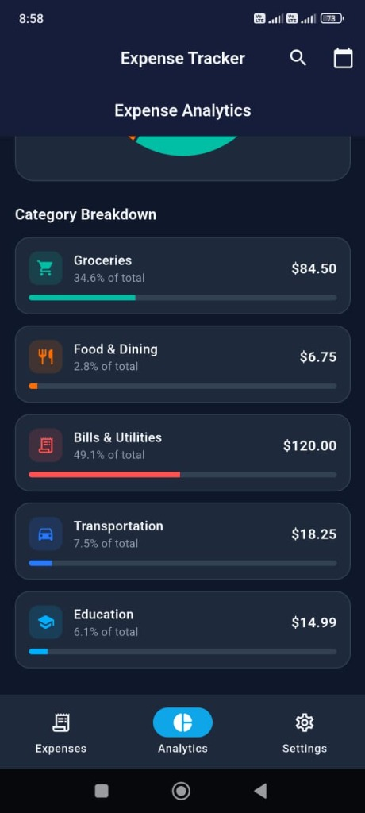 |

### 🌓 5. Light Theme & Settings
| Home Dashboard (Light) | Settings (Light Mode) | Settings & Profile (Dark) |
| :---: | :---: | :---: |
| 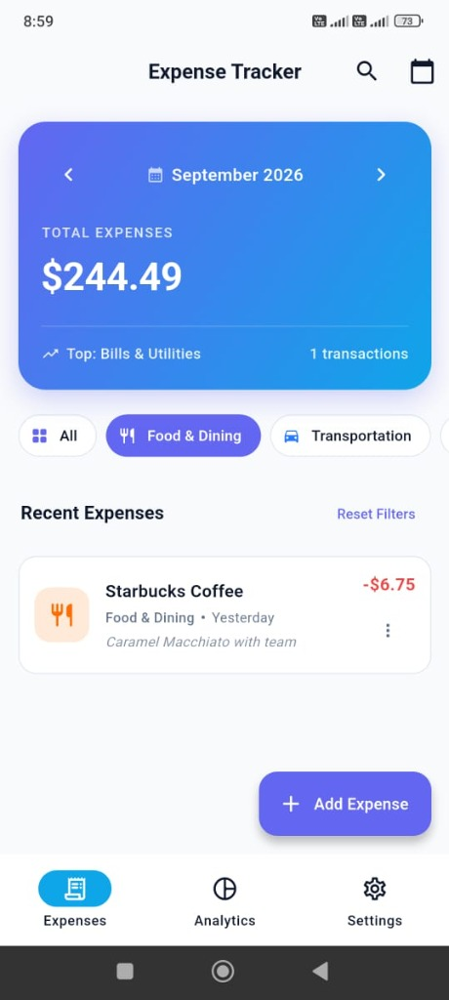 | 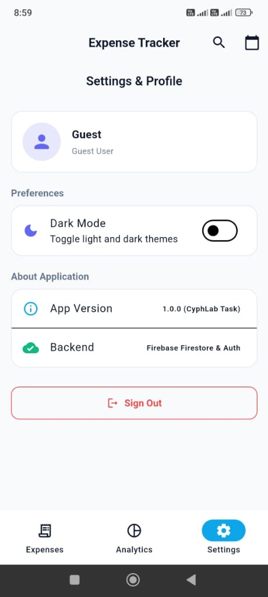 | 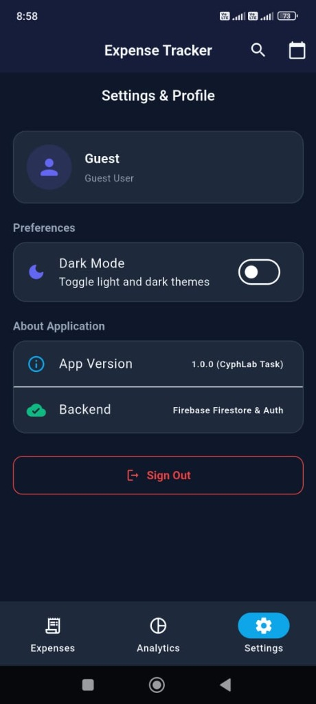 |

---

## 👨‍💻 Developer Information
- **Applicant**: Abinesh S. (Flutter Developer Intern Candidate)
- **Company**: CyphLab (Pvt) Ltd
- **Role**: Mobile App Developer Intern – Flutter
- **LinkedIn**: [linkedin.com/in/abinesh-s18](https://www.linkedin.com/in/abinesh-s18/)
